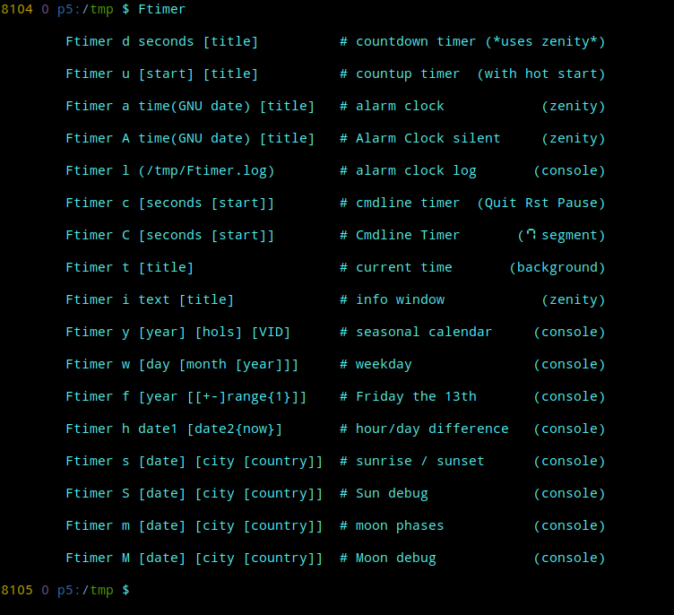

# bash-timer-zenity
bash countdown countup timer with zenity + cmdline

## shell function
add this to your .bash_aliases

test with
```
. btz.sh
```

run with
```
Ftimer
```

help:\


year:\


sun:\


moon:\


Uses the www.timeanddate.com *Calculators*.

For full functionality you have to enable the _OK_ button in the zenity progress dialog! It is disabled by default.

check:
```
d=/usr/share/zenity

cat --number "$d/zenity.ui" |sed -rn '/GtkButton.*zenity_progress_ok_button/, \%/object%p' |grep --color sensitive
```

You can set an icon for *alarm*, *time* and *info*.

examples:
```
Ftimer u 1:23:

time Ftimer c 5

Ftimer cmdline 0 $((60*60*24-5))

Ftimer a +10min &

Ftimer h 22-02-22T22:02:22

Ftimer y 6/21 12/31  # Very Important Day

Ftimer y 2024/2/29 2024

alias ft='Ftimer y 2023-09-11+18'
```

```
 $ Ftimer h -3day-4hour-5min-6sec
Tue 28 Jun 2022 05:02:38 PM CEST
Sat 25 Jun 2022 12:57:32 PM CEST
---
3 day 4 hour 5 min 6 sec
76 Hours  or  4565 Minutes  or  273.906 Seconds

```

-----

**Bad News!**  

*zenity 4* uses the imo ugly *gtk4*. And there is no more *zenity.ui*. You have to patch the source and compile yourself!

```
git clone https://github.com/GNOME/zenity && cd zenity

patch --verbose src/progress.c ../enable_OK_in_progress.patch

meson setup zen

meson compile -C zen

zen/src/zenity --progress --pulsate

# OK/default: ret 0
# Cancel:     ret 1
```

... and if you're unlucky also suppress a *libEGL* warning.
